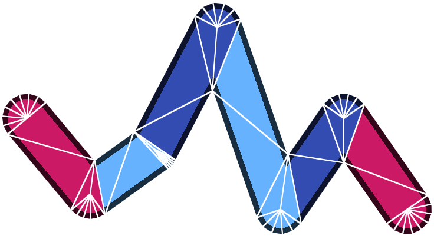
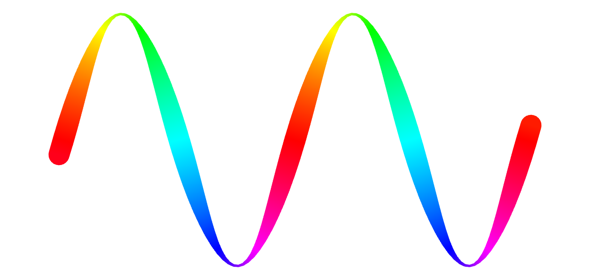

# regl-gpu-lines

> Pure GPU line drawing for [regl](https://github.com/regl-project/regl)

This module configures a very general command for drawing lines using the [regl](https://github.com/regl-project/regl) WebGL library. Its specific goals are:

- Data must not touch the CPU.
- No unnecessary constraints.

The first point means that this function performs very little CPU work at runtime and is optimized for the GPU. You can draw thousands of separate lines with just two WebGL draw calls.

This second point means that projection, colors, blending, and even GLSL attributes and varyings are up to you. In this sense it's almost more of a data flow framework for line rendering with which you can build the line rendering you require.

<p align="center">
  <div><a href="https://rreusser.github.io/regl-gpu-lines/docs/debug.html">Live demo &rarr;</a></div>
  
</p>

Some features and limitations:

- separate multiple disjoint lines by adding an attribute consisting of NaN(s) to the vertex list (see: [docs/multiple.html](https://rreusser.github.io/regl-gpu-lines/docs/multiple.html))
- line with only two vertices are not handled well and will consist only of overlapping end caps
- joins do not take into account variation in width, so varying width works best when varied slowly

## See also

- [regl-line2d](https://github.com/gl-vis/regl-line2d): The line rendering library used by Plotly.js. If you want production quality lines, you should go here.
- [regl-line](https://www.npmjs.com/package/regl-line): Another excellent library. A regl function to draw flat 2D and 3D lines.

## Install

Install from npm.

```bash
npm install regl-gpu-lines
```

## Example

The following code implements the image shown below. It passes a single attribute and uses preprocessor directives to connect it to the line width and position, as well as to pass the x-component to the fragment shader for coloring.

<p align="center">
  <div><a href="https://rreusser.github.io/regl-gpu-lines/docs/index.html">Live demo &rarr;</a></div>
  
</p>

```js
const regl = createREGL({extensions: ['ANGLE_instanced_arrays']});

const drawLines = createDrawLines(regl, {
  vert: `
    precision highp float;

    #pragma lines: attribute vec2 xy;
    #pragma lines: position = getPosition(xy);
    #pragma lines: width = getWidth(xy);
    #pragma lines: varying float x = getX(xy);

    vec4 getPosition(vec2 xy) { return vec4(xy, 0, 1); }
    float getWidth(vec2 xy) { return 50.0 * (0.5 + 0.4 * cos(16.0 * xy.x)); }
    float getX(vec2 xy) { return xy.x; }`,
  frag: `
    precision lowp float;
    varying float x;
    void main () {
      gl_FragColor = vec4(0.5 + cos(8.0 * (x - vec3(0, 1, 2) * 3.141 / 3.0)), 1);
    }`
});

const n = 101;
const xy = [...Array(n).keys()]
  .map(i => (i / (n - 1) * 2.0 - 1.0) * 0.8)
  .map(t => [t, 0.5 * Math.sin(8.0 * t)]);

const lineData = {
  join: 'round',
  cap: 'round',
  vertexCount: xy.length,
  vertexAttributes: {
    xy: regl.buffer(xy)
  },
  endpointCount: 2,
  endpointAttributes: {
    xy: regl.buffer([xy.slice(0, 3), xy.slice(-3).reverse()])
  }
};

function draw () {
  regl.poll();
  regl.clear({color: [0.2, 0.2, 0.2, 1]});
  drawLines(lineData);
}

draw();
```

## API

```js
import createDrawLines from 'regl-gpu-lines';
```

### `createDrawLines(regl, {vert, frag, debug})`

Instantiate a drawing command using the specified shaders.

- `regl`: [regl](https://github.com/regl-project/regl) instance
- `vert` (string): vertex shader, using pragma specification defined below
- `frag` (string): fragment shader
- `debug`: Debug mode, which exposes additional properties for viewing triangle mesh

### Vertex shader data flow

This module parses the specified vertex shader for GLSL `#pragma` directives which define the line properties and data flow. This should handle vertex attributes and varying parameters. If you require uniform values, you may pass them yourself by wrapping line drawing in your own `regl` command.

#### `#pragma lines: attribute <dataType> <attributeName>`
- `dataType`: one of `float`, `vec2`, `vec3`, `vec4`
- `attributeName`: name of attribute provided to draw command

#### `#pragma lines: position = <functionName>(<attributeList>)`
A builtin property which defines the `vec4` position of the vertex. Perspective division is performed automatically.
- `functionName`: name of function which returns the `vec4` position of the vertex
- `attributeList`: vertex attributes passed to the function

#### `#pragma lines: width = <functionName>(<attributeList>)`
A builtin property which defines the width of the line at a given vertex.
- `functionName`: name of function which returns the `float` device pixel width of the line at the given vertex
- `attributeList`: vertex attributes passed to the function

#### `#pragma lines: startcap = <functionName>(<attributeList>)`
A builtin property which defines whether a given line cap is at the beginning or end of a line. If `startcap` is not provided, then end caps are rendered in two passes, first starting caps, then ending caps. If provided, then end caps are rendered in a single pass.
- `functionName`: name of function which returns a `bool` indicating whether the cap is at the beginning or end of a line.
- `attributeList`: vertex attributes passed to the function. Attributes consumed by a `startcap` function advance at a rate of one stride per instance.

#### `#pragma lines: varying <type> <name> = <functionName>(<attributeList>)`
- `type`: type of varying parameter passed to fragment shader. One of `float`, `vec2`, `vec3`, vec4`.
- `name`: name of varying parameter passed to fragment shader
- `attributeList`: vertex attributes passed to the function


### Drawing lines

Drawing is invoked by passing an object with the following optional properties to the constructed draw command.

- `join` (string): `'round' | 'miter' | 'bevel'`
- `cap` (string): `'round' | 'square' | 'none'`
- `joinResolution` (number): number of triangles used to construct rounded joins
- `capResolution` (number): number of triangles used to construct rounded end caps
- `miterLimit` (number): Maximum extension of miter joins, in multiples of line widths, before they fall back to bevel joins.
- `vertexCount` (number): Total number of line vertices
- `endpointCount` (object): Total number of endpoints drawn (number of endpoint vertices divided by three)
- `vertexAttributes`: (object): Object containing regl buffer objects for each line vertex attribute, indexed by attribute name
- `endpointAttributes`: (object): Object containing regl buffer objects for each line endpoint vertex attribute, indexed by attribute name

## License

&copy; 2021 Ricky Reusser. MIT License
