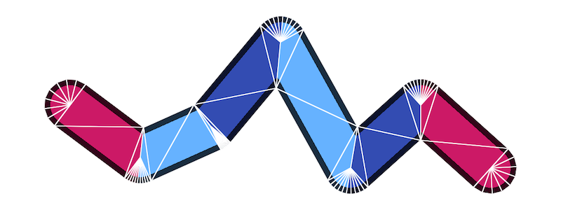

# regl-gpu-lines

> Pure GPU screen-projected lines for [regl](https://github.com/regl-project/regl)

This module implements a very general command for drawing lines using the [regl](https://github.com/regl-project/regl) WebGL library.

Architecturally, it has two goals:
- **Data lives on the GPU.** Since the CPU does not ever need to touch the data, you can draw thousands of separate lines very efficiently with just two WebGL draw calls.
- **Minimize unnecessary constraints.** The module facilitates setup, but projection, colors, blending, and even GLSL attributes and varyings are up to you. Think of it as a data flow framework for line rendering with which you can build the line rendering you require.

<p>
  <div><a href="https://rreusser.github.io/regl-gpu-lines/docs/debug.html">Live demo &rarr;</a></div>
  <div><a href="https://rreusser.github.io/regl-gpu-lines/docs/debug.html">
    
  </a></div>
</p>

Features:

- Configure your own attributes, varyings, uniforms, and shaders
- Round joins, miters, and bevels
- Square and rounded end caps
- Use `NaN` to separate disjoint lines (see: [docs/multiple.html](https://rreusser.github.io/regl-gpu-lines/docs/multiple.html))
- Pass additional regl configuration to the constructor

Limitations:

- Interior miters of sharp-angle corners need better limiting
- Lines with two vertices are rendered as overlapping end caps
- Joins do not take into account variation in width, so varying width is best varied slowly

## Examples

- [Basic example](./docs/basic.html): A basic line with end caps
- [Multiple lines](./docs/multiple.html): Use NaN to break up lines into multiple segments
- [Closed loop](./docs/closed-loop.html): Repeat the first three vertices at the end to create a closed loop
- [Debug](./docs/debug.html): Visually debug line geometry

## Install

Install from npm.

```bash
npm install regl-gpu-lines
```

## API

See [API documentation](./API.md).

## See also

- [regl-line2d](https://github.com/gl-vis/regl-line2d): The line rendering library used by Plotly.js. If you want production quality lines, you should go here.
- [regl-line](https://www.npmjs.com/package/regl-line): Another excellent library. A regl function to draw flat 2D and 3D lines.
- [screen-projected-lines](https://github.com/substack/screen-projected-lines): An excellent, concise module for screen-projected lines. Without joins or caps, such lines are much simpler.

## License

&copy; 2021 Ricky Reusser. MIT License
