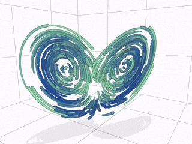

<p align="center">
  
</p>

# regl-gpu-lines

> Pure GPU instanced, screen-projected lines for [regl](https://github.com/regl-project/regl)

[API documentation &rarr;](./API.md)

[Live example &rarr;](https://rreusser.github.io/regl-gpu-lines/docs/debug.html)

[All examples &rarr;](#examples)

This module implements a very general command for drawing lines using the [regl](https://github.com/regl-project/regl) WebGL library.

Apart from drawing nice lines, architecturally it has two goals:
- **Data may live on the GPU.** Since the CPU is not required to touch the data, you can draw thousands of separate lines very efficiently with just two WebGL draw calls.
- **Minimize unnecessary constraints.** The module facilitates setup but is agnostic toward projection, colors, blending, etc. Attributes and varyings are up to you. Think of it as a data flow framework for line rendering with which you can build the line rendering you require.

Features:

- Configure your own attributes, varyings, uniforms, and shaders
- Round joins, miters, and bevels
- Square and rounded end caps
- Use `NaN` to separate disjoint lines (see: [docs/multiple.html](https://rreusser.github.io/regl-gpu-lines/docs/multiple.html))
- Pass additional regl configuration to the constructor

Limitations:

- Lines with two vertices are rendered as overlapping end caps
- Width is best varied slowly as line joins to not take into account varying width
- SDF borders Using the `lineCoord` are only constant-width with `round` joins
- Line dashes are possible by passing a varying attribute, but will be skewed due to the triangulation used

## Install

The `dist/` directory contains UMD bundles, or you may use from a CDN, e.g. [https://unpkg.com/regl-gpu-lines@0.0.12](https://unpkg.com/regl-gpu-lines@0.0.12). Both expose the module as `reglLines`.

Otherwise install from npm:

```bash
npm install regl-gpu-lines
```

## API

See [API documentation](./API.md).

## Examples

- [Basic example](https://rreusser.github.io/regl-gpu-lines/docs/basic.html): A minimal example. Just a line.
- [Variable width](https://rreusser.github.io/regl-gpu-lines/docs/variable-width.html): A basic line with variable width and color
- [Multiple lines](https://rreusser.github.io/regl-gpu-lines/docs/multiple.html): Use NaN to break up lines into multiple segments
- [Depth](https://rreusser.github.io/regl-gpu-lines/docs/depth.html): Layer lines using the z-coordinate
- [Closed loop](https://rreusser.github.io/regl-gpu-lines/docs/closed-loop.html): Create a closed loop by omitting end caps and repeating the first three vertices at the end.
- [Line border](https://rreusser.github.io/regl-gpu-lines/docs/border.html): Use `lineCoord` to draw a SDF line border
- [Interleaved attributes](https://rreusser.github.io/regl-gpu-lines/docs/strided.html): Instead of a [regl buffer](https://github.com/regl-project/regl/blob/master/API.md#buffers), you can pass a [regl-style attribute description](https://github.com/regl-project/regl/blob/master/API.md#attributes) with `buffer`, `stride`, `offset`, and `divisor` properties in order to used interleaved, packed attribute data.
- [Torus knot](https://rreusser.github.io/regl-gpu-lines/docs/knot.html): A [torus knot](https://en.wikipedia.org/wiki/Torus_knot) which can be difficult to draw with SVG.
- [Debug](https://rreusser.github.io/regl-gpu-lines/docs/debug.html): Visually debug line geometry
- [GPGPU Strange Attractors](https://observablehq.com/d/ab6cd8bb0137889c): Feed a GPU particle simulation from texture data directly into line rendering

<p align="center">
  <a href="https://observablehq.com/d/ab6cd8bb0137889c"></a>
</p>

A minimal example looks like the following, where a `vec2` attribute `xy` is connected to line position via a GLSL `#pragma`.

```js
const drawLines = reglLines(regl, {
  vert: `
    precision highp float;

    #pragma lines: attribute vec2 xy;
    #pragma lines: position = getPosition(xy);
    vec4 getPosition(vec2 xy) { return vec4(xy, 0, 1); }

    #pragma lines: width = getWidth();
    uniform float width;
    float getWidth() { return width; }`,
  frag: `
    precision lowp float;
    void main () {
      gl_FragColor = vec4(1);
    }`,
  uniforms: {
    width: (ctx, props) => props.customWidth * ctx.pixelRatio
  }
});

const xy = [[-1, 1], [-0.5, -1], [0, 1], [0.5, -1], [1, 1]];
const lineData = {
  customWidth: 20,
  join: 'round',
  cap: 'round',
  vertexCount: xy.length,
  vertexAttributes: {
    xy: regl.buffer(xy)
  },
  endpointCount: 2,
  endpointAttributes: {
    xy: regl.buffer([xy.slice(0, 3), xy.slice(-3).reverse()])
  }
};

drawLines(lineData);
```

## See also

- [regl-line2d](https://github.com/gl-vis/regl-line2d): The line rendering library used by Plotly.js. If you want production quality lines, you should go here.
- [regl-line](https://www.npmjs.com/package/regl-line): A regl function to draw flat 2D and 3D lines.
- [regl-insta-lines](https://github.com/deluksic/regl-insta-lines): A very clear and well-written module. Very close to what I was searching for. My main desire was to defer more of the configuration to runtime and to avoid overlap in the miters.
- [screen-projected-lines](https://github.com/substack/screen-projected-lines): An excellent, concise module for screen-projected lines. Without joins or caps, such lines are much simpler.
- [Drawing Lines is Hard](https://mattdesl.svbtle.com/drawing-lines-is-hard): [Matt DesLaurier](https://twitter.com/mattdesl)'s classic post on the topic of drawing lines.
- [Instanced Line Rendering Part I](https://wwwtyro.net/2019/11/18/instanced-lines.html): [Rye Terrell](https://wwwtyro.net/) first blog post on the topic.
- [Instanced Line Rendering Part II: Alpha blending](https://wwwtyro.net/2021/10/01/instanced-lines-part-2.html): [Rye Terrell](https://wwwtyro.net/)'s blog post which inspired me to pare the draw calls down to two and publish this module.

## License

&copy; 2021 Ricky Reusser. MIT License.
